# TeleOp Runtime

When programming the teleop mode of the robot (not the autonomous!), there are two phases that code can be run on: the _pre_ and the _cycle_ phases.

|Pre|Cycle|
|-|-|
|Only runs once, at the very beginning|Runs multiple times a second, until the robot stops|
|Commonly used for initializing and configuring hardware (motors, servos)|Commonly used for reacting to controller input and moving the robot|

<p>
    
</p>

The runtime works through the concept of a runloop (or [event loop](https://en.wikipedia.org/wiki/Event_loop)). A runloop repeats forever until the program is finished, updating an output based on a change in input. It repeatedly calls the cycle phase's code until the robot stops. In Kotlin pseudo-code, the runloop for the Arch API looks like this:

```kotlin
// Overly-simplified, pseudo-code version of the Runtime
pre.run()

teleop.waitForStart()

while (teleop.opModeIsActive()) {
    cycle.run()
}
```

> **Note:** This example leaves out some details, like _plugins_. For the actual source code, please look [here](https://github.com/BotsBurgh/BOTSBURGH-FTC-2022-23/blob/develop/TeamCode/src/main/java/org/firstinspires/ftc/teamcode/arch/runtime/Runtime.kt).

> **Note:** There used to be a way to insert code to be run when the stop button was clicked, but it never worked and has since been deprecated. Any documentation or code that mentions the _post_ phase has been disabled / removed.

This approach of a runloop is common for robots in FTC. It is the same approach that we used last year, though now it is integrated with the Arch API.
