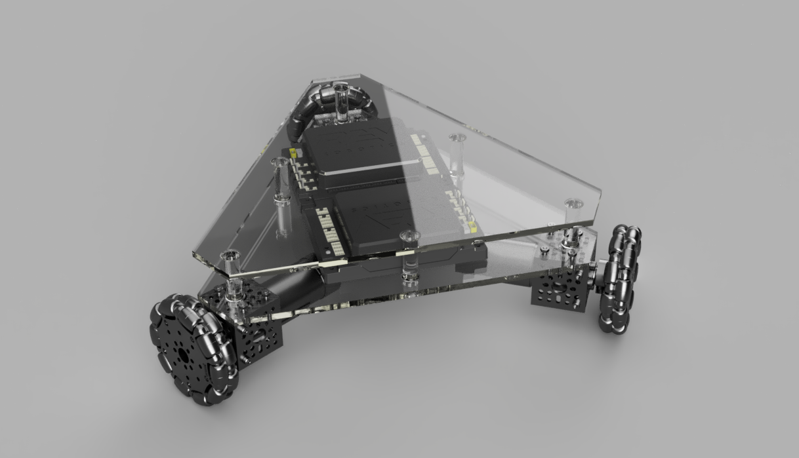

# Moving a Triangle Robot

This year our team designed a triangle omni robot instead of a normal 4-wheeled one.



In order to accomplish this, the programmers needed to research how to control the 3 motors to actually move the robot. The hope was to be able to move the robot in any direction by using a joystick on the controller. This meant converting an X and Y coordinate from the joystick to 3 separate numbers from -1 to 1 determining how fast each motor should spin.

This was a big task. While we were able to accomplish it fairly quickly through some internet research ([this explanation was the most helpful!](https://robotics.stackexchange.com/a/7833)), fully understanding how it works took a lot longer.

## TL;DR

You can calculate the power of each wheel by using the angle in radians and strength of the jostick, as well as the angle offset from 0 radians for each wheel.

```kotlin
const val MOTOR_1_ANGLE = 0.0 // 0 degrees, 0 / 3, front wheel
const val MOTOR_2_ANGLE = PI * (2.0 / 3.0) // 120 degrees, 1 / 3, back left wheel
const val MOTOR_3_ANGLE = 2.0 * MOTOR_3_ANGLE // 240 degrees, 2 / 3, back right wheel

// Get joyX and joyY from the gamepad.

val joyRadians = atan2(joyY, joyX)
val joyMagnitude = sqrt(joyY * joyY + joyX * joyX) // Strength

val motor1Power = joyMagnitude * sin(MOTOR_1_ANGLE - joyRadians)
val motor2Power = joyMagnitude * sin(MOTOR_2_ANGLE - joyRadians)
val motor3Power = joyMagnitude * sin(MOTOR_3_ANGLE - joyRadians)
```

Yup. That's it. There's definitely more you can do, like handling the dead space that appears when converting from Cartesion (XY) coordinates and polar coordinates, but this is the simplest version.
